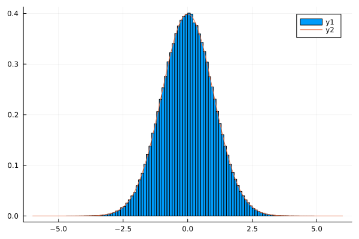
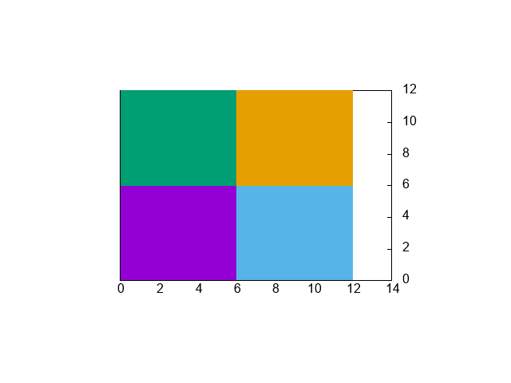
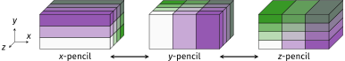
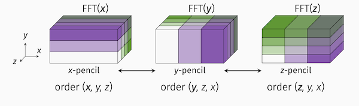

# Some Julia tools for HPC


Pierre Navaro - IRMAR (Institut de Recherche Mathématique de Rennes) 

# Who am I ?

 - Scientific computing engineer

 - **Fortran 77 + PVM** : during my PhD 1998-2002 (Université du Havre)

 - **Fortran 90-2003 + OpenMP-MPI** : Engineer in Strasbourg (2003-2015) at IRMA

 - **Numpy + Cython, R + Rcpp** : Engineer in Rennes (2015-now) at IRMAR

 - **Julia v1.0** since July 2018


 https://github.com/JuliaVlasov/Numkin2019

 https://github.com/pnavaro/Numkin2022

---

# Why Julia ?

## Solution to the "two-language problem"

Single code for prototyping and production
- Simple and high-level ``\Rightarrow``low developpement cost
- Fast like C or Fortran
- No need of a compilation tool like CMake
- Very easy to package and manage dependencies.
- UTF8 and metaprogramming allows syntax close to the math.
Backend agnostic:
- Single code to run on single CPU or thousands of GPUs
- Single code to run on various CPUs and GPUs.
Interactive:
- No need for third-party visualisation software
- Debugging and interactive REPL mode are efficient for development

---

# Threads 

```julia
julia> using .Threads

julia> println("Number of threads $(nthreads())")
Number of threads 4

julia> a = zeros(12)
12-element Vector{Float64}:
 0.0
 0.0
 0.0
 0.0
 0.0
 0.0
 0.0
 0.0
 0.0
 0.0
 0.0
 0.0

julia> @threads for i = eachindex(a)
           a[i] = threadid()
       end

julia> println(a)
[2.0, 2.0, 2.0, 1.0, 1.0, 1.0, 3.0, 3.0, 3.0, 4.0, 4.0, 4.0]
```

---

# Particles deposition

<table><tr><td>
```julia
using Random, Plots

nx = 100
np = 1_000_000
xmin, xmax = -6, 6

xp = randn(np);

histogram(xp, normalize=true, bins=nx)
plot!(x-> (exp(-x^2/2))/sqrt(2π), -6, 6)
```
</td><td>

</td></yr>


---

# Serial deposition

```julia
"""
    serial_deposition( xp, xmin, xmax, nx )

computes the normalized density from the particles position ``xp`` 
using the nearest grid point algorithm
"""
function serial_deposition( xp, xmin, xmax, nx )

    rho = zeros(Float64, nx)

    for i in eachindex(xp)

        x_norm = (xp[i]-xmin) / (xmax - xmin) # normalized position
        ip = trunc(Int,  x_norm * nx) + 1 # nearest grid point
        rho[ip] += 1

    end

    rho ./ sum(rho .* (xmax - xmin) / nx)

end
```


---

# Parallel deposition

```julia
function parallel_deposition( xp, xmin, xmax, nx )

    rho = zeros(Float64, nx)
    rho_local = [copy(rho) for _ in 1:ntid] # allocate an array of arrays for each thread

    @sync for chunk in Iterators.partition(1:np, np÷nthreads())
        @spawn begin
            for i in chunk
                x_norm = (xp[i]-xmin) / (xmax - xmin)
                ip = trunc(Int,  x_norm * nx)+1
                rho_local[threadid()][ip] += 1
            end
        end
    end

    rho .= reduce(+,rho_local)
    rho ./ sum(rho .* (xmax - xmin) / nx)

end

t_serial = @belapsed serial_deposition($xp, $xmin, $xmax, $nx);
t_thread = @belapsed parallel_deposition($xp, $xmin, $xmax, $nx);
println("$(t_serial / t_thread)")
```
3.12

---

# MPI 

Just `add MPI` in `pkg` mode and it will install the `MPI.jl` package + the MPI library by default.
To use your existing installation. Use `MPIPreferences`

--

```
julia --project -e 'using MPIPreferences; MPIPreferences.use_system_binary()'
┌ Info: MPI implementation identified
│   libmpi = "libmpi"
│   version_string = "Open MPI v4.1.4, package: Open MPI brew@Monterey Distribution, ident: 4.1.4, repo rev: v4.1.4, May 26, 2022\0"
│   impl = "OpenMPI"
│   version = v"4.1.4"
└   abi = "OpenMPI"
┌ Info: MPIPreferences changed
│   binary = "system"
│   libmpi = "libmpi"
│   abi = "OpenMPI"
└   mpiexec = "mpiexec"
```

---

# MPI Requirements

MPI.jl requires a shared library installation of a C MPI library,
supporting the MPI 3.0 standard or later. The following MPI
implementations should work out-of-the-box with MPI.jl:

- Open MPI
- MPICH (v3.1 or later)
- Intel MPI
- Microsoft MPI
- IBM Spectrum MPI
- MVAPICH
- Cray MPICH
- Fujitsu MPI
- HPE MPT/HMPT

The configuration is well [documented](https://juliaparallel.org/MPI.jl/latest/configuration/)
with notes to HPC cluster administrators.

---

# MPI Usage

```julia
using MPI
MPI.Init()

comm = MPI.COMM_WORLD
println("Hello world, I am $(MPI.Comm_rank(comm)) of $(MPI.Comm_size(comm))")
MPI.Barrier(comm)
```
--
```
$  mpiexec -n 4 julia --project examples/01-hello.jl
Hello world, I am 3 of 4
Hello world, I am 1 of 4
Hello world, I am 0 of 4
Hello world, I am 2 of 4
```

In your batch scripts, it is recommended to add a precompilation step

---

# MPIClusterManager.jl

```julia
julia> using MPIClusterManagers # to import MPIManager
julia> using Distributed # need to also import Distributed to use addprocs()

julia> manager=MPIManager(np=4) # specify, number of mpi workers, launch cmd, etc.

julia> addprocs(manager) # start mpi workers and add them as julia workers too.
```

```julia
julia> @mpi_do manager begin
         using MPI
         comm=MPI.COMM_WORLD
         println("Hello world, I am $(MPI.Comm_rank(comm)) of $(MPI.Comm_size(comm))")
       end
From worker 5:	Hello world, I am 3 of 4
From worker 2:	Hello world, I am 0 of 4
From worker 4:	Hello world, I am 2 of 4
From worker 3:	Hello world, I am 1 of 4
```

---

# Maxwell solver in two dimensions with FDTD scheme

```math
\frac{\partial H_z}{\partial t} = \frac{\partial E_x}{\partial y} - \frac{\partial E_y}{\partial x}
;\qquad
\frac{\partial E_x}{\partial t} = \frac{\partial H_z}{\partial y}
;\qquad
\frac{\partial E_y}{\partial t} = - \frac{\partial H_z}{\partial x} 
```

<table><tr><td>

</td><td>
```math
Hz^{n+1/2}_{i+1/2,j+1/2} = Hz^{n-1/2}_{i+1/2,j+1/2}
+ \frac{dt}{dy} (Ex^{n}_{i+1/2,j+1} - Ex^{n}_{i+1/2,j}) \\
- \frac{dt}{dx} (Ey^{n}_{i+1,j+1/2} - Ey^{n}_{i,j+1/2})
```

```math
Ex^{n+1}_{i+1/2,j} = Ex^{n}_{i+1/2,j} + \frac{dt}{dy} ( Hz^{n+1/2}_{i+1/2,j+1/2} - Hz^{n+1/2}_{i-1/2, j-1/2} )
```

```math
Ey^{n+1}_{i,j+1/2} = Ey^{n}_{i,j+1/2} - \frac{dt}{dx} ( Hz^{n+1/2}_{i+1/2,j+1/2} - Hz^{n+1/2}_{i-1/2, j+1/2})
```
</td></tr></table>

---

## MPI topology

<table><tr><td>
```julia
using MPI

MPI.init()
comm = MPI.COMM_WORLD
proc = MPI.Comm_size(comm)
rank = MPI.Comm_rank(comm)

MPI.Barrier(comm)
    
tcpu1 = MPI.Wtime()
    
dims = [0 0]
ndims = length(dims)
periods = [1 1]
reorder = 1
    
MPI.Dims_create!(proc, dims)
comm2d = MPI.Cart_create(comm, dims, periods, reorder)
    
north, south = MPI.Cart_shift(comm2d,0,1)
west,  east  = MPI.Cart_shift(comm2d,1,1)
    
coords = MPI.Cart_coords(comm2d)
```
</td><td></td></tr>

---

# MPI communication
    
```julia
nxp, nyp = dims

mx = nx ÷ nxp
my = ny ÷ nyp

# Send to North  and receive from South
MPI.Sendrecv!(view(bz, 1,   1:my), north, tag,
              view(bz, mx+1, 1:my), south, tag, comm2d)

# Send to West and receive from East
MPI.Sendrecv!(view(bz, 1:mx,   1), west, tag,
              view(bz, 1:mx,my+1), east, tag, comm2d)
```

```julia
sum_err_l2 = MPI.Allreduce(err_l2, +, comm2d)
```

---

# PencilArrays.jl

Juan Ignacio Polanco (CNRS Grenoble, France.)

- A set of open-source Julia libraries for conveniently and efficiently dealing with distributed data.
- Aimed at numerically solving PDEs on massively-parallel computers. 
- Well-adapted for describing structured grids.
- Developed with spectral methods in mind, but also useful for other approaches like semi-lagrangian methods.



---

# What's provide PencilArrays.jl and PencilFFTs.jl

- easy definition of domain decomposition configurations (and on arbitrary numbers of dimensions)
- `PencilArray` type for dealing with distributed data
- efficient transpositions between configurations
- zero-cost index permutations + contiguous iterators
- convenient parallel I/O (both raw MPI-IO and parallel HDF5)
- distributed FFTs and related transforms (PencilFFTs.jl package)


---

# Minimal example

```julia
using MPI, PencilArrays
MPI.Init()
comm = MPI.COMM_WORLD
Nx, Ny, Nz = (256, 64, 128)  # global domain dimensions
# Automatically generate a decomposition over all processes
pen = Pencil((Nx, Ny, Nz), comm)
# Construct a distributed array
u = PencilArray{Float64}(undef, pen)
println(topology(pen))
```
MPI topology: 2D decomposition (2×2 processes)
```julia
println(size_local(pen))
```
(256, 32, 64)
```julia
println(range_local(pen))
```
(1:256, 33:64, 1:64)
(1:256, 1:32, 65:128)
(1:256, 1:32, 1:64)
(1:256, 33:64, 65:128)

---

# PencilArray

```julia
dims = (32, 8, 16); comm = MPI.COMM_WORLD;
pen = Pencil(dims, comm);
u = PencilArray{Float64}(undef, pen);
rand!(u);  # fill with random values (requires `using Random`)
```

```julia
summary(u)
```
32×4×8 PencilArray{Float64, 3}(::Pencil{3, 2, NoPermutation, Array})


```julia
summary(parent(u))
```
32×4×8 Array{Float64, 3}


---

## Global grid

```julia
Nx, Ny, Nz = (33, 9, 17); comm = MPI.COMM_WORLD
pen = Pencil((Nx, Ny, Nz), comm)
xs_global = range(-1, 1; length = Nx)
ys_global = range( 0, 1; length = Ny)
zs_global = range( 0, 2; length = Nz)
```

## Local grid

```julia
grid = localgrid(pen, (xs_global, ys_global, zs_global));
u = PencilArray{Float64}(undef, pen);
@. u = sin(grid.x) * cos(grid.y) * cos(grid.z);
```

```julia
for I ∈ eachindex(grid)
    x, y, z = grid[I]
    u[I] = sin(x) * cos(y) * cos(z)
endo
```

---



PencilArrays.jl provides a generic and zero-overhead interface to dimension permutations.
- allows to easily switch between regular and distributed arrays
- indices are permuted at compile time
- iteration is performed in memory order

```julia
julia> dims = (32, 8, 16); comm = MPI.COMM_WORLD;
julia> pen = Pencil(dims, comm; permute = Permutation(3, 2, 1));
julia> u = PencilArray{Float64}(undef, pen); randn!(u);
julia> size_local(u), size_local(u, MemoryOrder())
(32, 4, 8) (8, 4, 32)
```
Use `CartesianIndices` to optimize your loops
```julia
sum = 0.0
for I ∈ CartesianIndices(u)
    i, j, k = Tuple(I)
    c = i + 2j + 3k
    sum += c * u[I]
end
```

---

# Transposing

```julia
dims = (32, 8, 16); comm = MPI.COMM_WORLD;

pen_x = Pencil(dims, (2, 3), comm);  # decompose along (y, z)

pen_y = Pencil(pen_x; decomp_dims = (1, 3),   #  along (x, z)
                      permute = Permutation(2, 3, 1));
```

```julia
ux = PencilArray{Float64}(undef, pen_x) 
randn!(ux);

uy = PencilArray{Float64}(undef, pen_y)

transpose!(uy, ux);

gather(ux) == gather(uy)
```
true

---


# Gray-Scott system

```math
\begin{aligned}
\frac{\partial u}{\partial t} & = D\_u \Delta u - uv^2 + F(1-u) \\\\ 
\frac{\partial v}{\partial t} & = D\_v \Delta v + uv^2 - (F+k)v 
\end{aligned} 
```

## laplacian 

```math
\Delta u\_{i,j} \approx u\_{i,j-1} + u\_{i-1,j} -4u\_{i,j} + u\_{i+1, j} + u\_{i, j+1} 
```

- Euler scheme is used to integrate the time derivative.  

---

# Initial conditions

- ``u`` is 1 everywhere and ``v`` is 0 in the domain except in a square zone where ``v = 0.25`` and ``u = 0.5``. This square located in the center of the domain is  ``[0, 1]\times[0,1]`` with a size of ``0.2``.

```julia
const Dᵤ = .1
const Dᵥ = .05
const F = 0.0545
const k = 0.062

function init(n)
 
    u = ones((n+2,n+2))
    v = zeros((n+2,n+2))
    
    x, y = LinRange(0, 1, n+2), LinRange(0, 1, n+2)

    for j in eachindex(y), i in eachindex(x)
        if (0.4<x[i]) && (x[i]<0.6) && (0.4<y[j]) && (y[j]<0.6)
    
            u[i,j] = 0.50
            v[i,j] = 0.25
        end
    end
        
    return u, v
end
```

---

# Serial function

```julia
function grayscott!( u, v, Δu, Δv)

    n = size(Δu,1)

    for c = 1:n
        c1 = c + 1
        c2 = c + 2
        for r = 1:n
            r1 = r + 1
            r2 = r + 2
            @inbounds Δu[r,c] = u[r1,c2] + u[r1,c] + u[r2,c1] + u[r,c1] - 4*u[r1,c1]
            @inbounds Δv[r,c] = v[r1,c2] + v[r1,c] + v[r2,c1] + v[r,c1] - 4*v[r1,c1]
        end
    end

    for c = 1:n
        c1 = c + 1
        for r = 1:n
            r1 = r + 1  
            @inbounds uvv = u[r1,c1]*v[r1,c1]*v[r1,c1]
            @inbounds u[r1,c1] +=  Dᵤ * Δu[r,c] - uvv + F*(1 - u[r1,c1])
            @inbounds v[r1,c1] +=  Dᵥ * Δv[r,c] + uvv - (F + k)*v[r1,c1]
        end
    end

end
```

---

# Simulation


<table><tr><td>
```julia
using Plots

function run_simulation( n = 300, maxiter = 10_000)
    u, v = init(n)
    Δu = zeros(n, n)
    Δv = zeros(n, n)
    options = (aspect_ratio = :equal, axis = nothing, 
               legend = :none, framestyle = :none)
    @gif for t in 1:maxiter
        grayscott!(u, v, Δu, Δv)
        heatmap(u; options...)
    end every 100
    return u, v
end

u, v = run_simulation(500)
```
</td><td></td></tr>

---

# Threads

```julia
using .Threads

function grayscott_threads!( u, v, Δu, Δv)

    n = size(Δu,1)

    @threads for c = 1:n
        c1 = c + 1
        c2 = c + 2
        for r = 1:n
            r1 = r + 1
            r2 = r + 2
            @inbounds Δu[r,c] = u[r1,c2] + u[r1,c] + u[r2,c1] + u[r,c1] - 4*u[r1,c1]
            @inbounds Δv[r,c] = v[r1,c2] + v[r1,c] + v[r2,c1] + v[r,c1] - 4*v[r1,c1]
        end
    end

    @threads for c = 1:n
        c1 = c + 1
        for r = 1:n
            r1 = r + 1  
            @inbounds uvv = u[r1,c1]*v[r1,c1]*v[r1,c1]
            @inbounds u[r1,c1] +=  Dᵤ * Δu[r,c] - uvv + F*(1 - u[r1,c1])
            @inbounds v[r1,c1] +=  Dᵥ * Δv[r,c] + uvv - (F + k)*v[r1,c1]
        end
    end

end
```

---

Time of serial version 10K steps with 500 x 500 points : 8.7 secs

Time of threaded (x16) version 10K steps with 500 x 500 points : 2.6 secs

---

# Vectorized version

```julia

function grayscott_vectorized!(u, v, Δu, Δv, uvv)

    @views Δu .= (u[1:end-2,2:end-1] .+ u[2:end-1,1:end-2] .+ u[2:end-1, 3:end] 
                 .+ u[3:end,2:end-1] .- 4*u[2:end-1, 2:end-1] )

    @views Δv .= (v[1:end-2,2:end-1] .+ v[2:end-1,1:end-2] .+ v[2:end-1, 3:end] 
                 .+ v[3:end,2:end-1] .- 4*v[2:end-1, 2:end-1] )

    @views uvv .= u[2:end-1,2:end-1] .* v[2:end-1,2:end-1] .* v[2:end-1,2:end-1]

    @views u[2:end-1,2:end-1] .+=  Dᵤ .* Δu .- uvv .+ F * (1 .- u[2:end-1,2:end-1])

    @views v[2:end-1,2:end-1] .+=  Dᵥ .* Δv .+ uvv .- (F + k) .* v[2:end-1,2:end-1]
         
end
```

- Time of vectorized version 10K steps with 500 x 500 points : 26 secs

---

# GPU

```julia

using CUDA

function run_on_gpu( n = 500, maxiter = 10_000)

    u0, v0 = init(n)

    u = CuArray(u0)
    v = CuArray(v0)

    Δu = CUDA.zeros(n, n)
    Δv = CUDA.zeros(n, n)
    uvv = CUDA.zeros(n,n)
    
    for t in 1:maxiter
    
        grayscott_vectorized!(u, v, Δu, Δv, uvv)

    end

    return Array(u), Array(v)

end

@time u, v = run_on_gpu( 500)
```

Takes only 1 sec on Tesla v100 and the speed-up is much better when we raise the number of points.

---

# ParallelStencil.jl

It offers a `FiniteDifferences` module to enable math-close notation
and the `CUDA` "backend". We could also simply switch the backend to
`Threads`.

```julia
USE_GPU = true

using ParallelStencil
using ParallelStencil.FiniteDifferences2D

@static if USE_GPU

    @init_parallel_stencil(CUDA, Float64, 2)
    CUDA.device!(0)

else

    @init_parallel_stencil(Threads, Float64, 2)

end
```

---

# `FiniteDifferences2D`

```julia
@parallel function grayscott_ps!( u, v, Δu, Δv, uvv)
    
    @all(Δu) = @d2_xi(u) + @d2_yi(u)
    @all(Δv) = @d2_xi(u) + @d2_yi(v)
       
    @all(uvv) = @inn(u) * @inn(v) * @inn(v)
    @inn(u) = @inn(u) + Dᵤ * @all(Δu) - @all(uvv) + F * (1 - @inn(u))
    @inn(v) = @inn(v) + Dᵥ * @all(Δv) + @all(uvv) - (F + k) * @inn(v)
    return
end
```

```julia
julia> ?@inn
@inn(A): Select the inner elements of A. Corresponds to A[2:end-1,2:end-1].
```

```julia
julia> ?@d2_xi
@d2_xi(A): Compute the 2nd order differences between adjacent elements of A
along the dimension x and select the inner elements of A in the remaining dimension. Corresponds to @inn_y(@d2_xa(A)).
```

---

```julia
function run_with_ps( n = 500, maxiter = 10_000)

    u0, v0 = init(n)

    u = Data.Array(v0)
    v = Data.Array(v0)

    Δu = @zeros(n, n)
    Δv = @zeros(n, n)
    uvv = @zeros(n,n)
    
    for t in 1:maxiter
    
        @parallel grayscott_ps!(u, v, Δu, Δv, uvv)

    end

    u, v

end

@time u, v = run_with_ps(500)
```
Takes only 0.3 secs on Tesla v100 

---

# Some interesting frameworks for HPC in Julia

- [ImplicitGlobalGrid.jl](https://github.com/eth-cscs/ImplicitGlobalGrid.jl):  Multi-GPU/CPU with communication-computation overlap.  Works combined with ParallelStencil.jl.
- [PartitionedArrays.jl](https://github.com/fverdugo/PartitionedArrays.jl): Julia alternative to PETSc that allows interative developping 
- [MPIHaloArrays.jl](https://github.com/smillerc/MPIHaloArrays.jl):high-level array type to facilitate halo, or ghost-cell exchanges. 
- [Trixi.jl](https://github.com/trixi-framework/Trixi.jl) : numerical simulation framework for hyperbolic conservation laws. 
    + 1D, 2D, 3D simulations on almost every mesh possible
    + Discontinuous Galerkin methods
    + Compatible with the SciML ecosystem for ordinary differential equations
    + Works for Multi-component compressible Euler and MHD equations.
    + Shared-memory parallelization via multithreading
    + Tools for pre-processing (mesh generation) and post-processing (Paraview)
- [Gridap.jl](https://github.com/gridap/Gridap.jl): set of tools for the grid-based approximation of partial differential equations.
    + Mesh generation with GMESH
    + Linear solvers use PETSc
    + Syntax of finite elements formulation is very close to the math
    + [Poisson 1d example](https://github.com/gridap/Gridap.jl/blob/master/test/GridapTests/Poisson1DTests.jl)


---

# See also

## Julia for HPC

https://enccs.github.io/Julia-for-HPC/

## Julia: Parallel computing revisited

https://www.youtube.com/watch?v=xTLFz-5a5Ec

## Julia programming: HPC topics

https://youtu.be/bXHe7Kj3Xxg

## Natively compile and run parallel Hello World with MPICH_jll MPI in Julia!

https://gist.github.com/brenhinkeller/538502bc47dcb29fc7becfff70ff06d4
